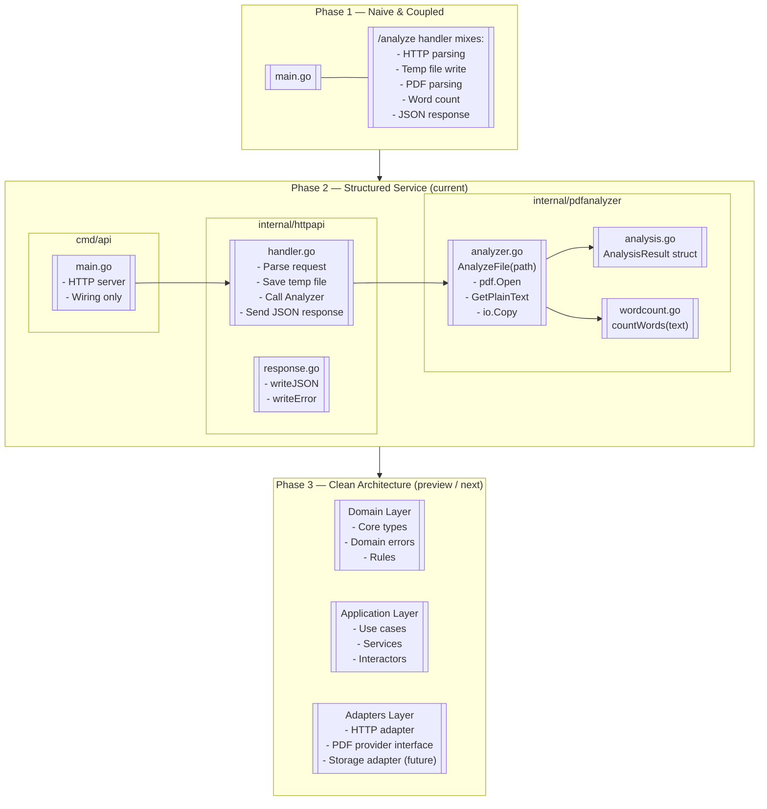

# 📄 PDF Expert — From naive script to structured Go service

`pdf-expert` is a Go service that analyzes PDF files and returns a simple word count.
The project is intentionally built in phases, evolving from:

1. a naive, coupled implementation (Phase 1),
2. to a minimally structured internal design (Phase 2, current),
3. and then toward a clean architecture style (Phase 3).

The goal is not only to ship a working service, but to show the evolution from “just works” to “well structured”.

---

## 🎯 High-level goals

- Validate PDF extraction in Go with real files.
- Gradually introduce structure (packages, components, models).
- Prepare the codebase for a clean, testable architecture.
- Document the reasoning behind each major change using ADRs (Architectural Decision Records).

---

## Mermaid


## 🧪 Phase 1 — Naive and coupled (completed)

What it was:

- Single main.go.
- One endpoint: POST /analyze.
- File upload via form.
- Temporary file written to disk.
- Direct use of github.com/ledongthuc/pdf.
- Simple word counting with whitespace detection.
- No packages, no layers, no tests, no abstractions.

Why it existed:

Phase 1 had one job: prove that PDF extraction works end-to-end in the simplest possible way.

- Validate that the PDF library can:
  - open real PDF files,
  - extract text,
  - handle basic cases.
- Validate the HTTP flow: upload → parse → respond.

This validation and the decision to accept a simple and coupled architecture are documented in:

- ADR/ADR001.md — Initial simple and coupled architecture to validate PDF extraction.

Once the library and basic flow were validated, Phase 1 was closed. It was never meant to be “good”; it was meant to be honest and minimal.

---

## 🧱 Phase 2 — From script to structured service (current)

Phase 2 focuses on introducing minimal structure without jumping directly into full clean architecture.

Key changes:

- Introduced a basic package layout:
  - cmd/api/main.go — starts the HTTP server and wires dependencies.
  - internal/httpapi/ — HTTP handlers and JSON response helpers.
  - internal/pdfanalyzer/ — PDF analysis logic.

- Extracted PDF analysis into a dedicated component:
  - PDFAnalyzer type with:
    - AnalyzeFile(path string) (AnalysisResult, error)
  - Uses pdf.Open + GetPlainText + io.Copy + bytes.Buffer.
  - Encapsulates text extraction and word counting.

- Introduced a simple result model:
  - AnalysisResult with:
    - Content — raw text extracted.
    - WordCount — naive word count.

- Separated concerns within internal/pdfanalyzer:
  - analysis.go — result struct(s).
  - analyzer.go — main PDF parsing flow.
  - wordcount.go — helper for word counting.

- Improved HTTP response handling:
  - writeJSON and writeError helpers in internal/httpapi/response.go.
  - Consistent JSON for success and error responses.

External behavior (API contract) remains intentionally simple:

- POST /analyze with form field file=@your.pdf returns:
```json
    {
      "file": "your.pdf",
      "word_count": 1234,
      "status": "completed"
    }
```


### ADRs related to Phase 2 refactors:

- ADR/ADR002.md — Introduce basic package structure
- ADR/ADR003.md — Extract PDF analysis into a dedicated component
- ADR/ADR004.md — Improve HTTP handler and JSON response structure
- ADR/ADR005.md — Add unit tests for core logic (planned within Phase 2)
- ADR/ADR006.md — Introduce AnalysisResult struct
- ADR/ADR007.md — Extract word counting logic into wordcount.go
- ADR/ADR008.md — Reorganize analyzer into analysis.go + analyzer.go

Phase 2 is about turning the one-file script into a service with clear internal boundaries, while keeping the external API deliberately small.

---

## 🧭 Phase 3 — Toward clean architecture (next step)

Phase 3 is where the project starts to look like a production-ready Go backend, with clearer separation between:

- Domain — what the system does (PDF analysis, rules, decisions).
- Application — how use cases are orchestrated (services, workflows).
- Interfaces / Adapters — how HTTP, storage, and PDF libraries plug in.

Target directions for Phase 3:

1) Define a domain layer

- Domain types for:
  - PDF analysis results (extended),
  - analysis requests (e.g., by path, by uploaded file).
- Explicit domain errors (e.g., unsupported format, parse failure).

2) Introduce an application/service layer

- Use cases like:
  - AnalyzeUploadedFile(...),
  - AnalyzeStoredFile(...) (future).
- Keep HTTP-specific logic out of the domain/app layers.

3) Abstract external dependencies behind interfaces

- Interface for PDF analysis provider (implemented by PDFAnalyzer).
- Interface for storage (if/when we persist results).
- Interface for logging (if needed beyond standard logging).

4) Configuration and environment

- Centralize config loading (port, temp path, limits).
- Prepare for different environments (development, test, production).

5) Testing focus

- Unit tests for:
  - domain logic,
  - application services (with simple fakes or mocks for adapters).
- Avoid hitting real filesystem or PDF library in most unit tests.

Phase 3 will not be implemented all at once. It will be built incrementally, guided by new requirements and backed by new ADRs.

---

## 🔭 Future phases (high-level only)

Later phases (beyond Phase 3) are intentionally left as future work, but the general direction is:

- Asynchronous processing:
  - in-memory job queue,
  - worker pool with goroutines.

- Operational concerns:
  - health checks,
  - basic metrics endpoint,
  - better error surfaces.

- Optional persistence:
  - storing analyzed results,
  - reusing analysis instead of re-parsing.

These will only be introduced when the foundations from Phase 3 are in place.

---

## 📂 Current project layout (Phase 2)
```sh
    github.com/jorgediasdsg/pdf-expert/
      cmd/
        api/
          main.go                 # HTTP server setup and wiring
      internal/
        httpapi/
          handler.go              # /analyze endpoint
          response.go             # JSON helpers
        pdfanalyzer/
          analysis.go             # AnalysisResult and related structs
          analyzer.go             # AnalyzeFile implementation
          wordcount.go            # naive word counting
      ADR/
        ADR001.md
        ADR002.md
        ADR003.md
        ADR004.md
        ADR005.md
        ADR006.md
        ADR007.md
        ADR008.md
      Makefile
      DEVELOPMENT.md
      README.md
      go.mod
      go.sum
```

---

## 🚀 Running the service

Assuming Go is installed and go.mod is initialized with:

    module github.com/jorgediasdsg/pdf-expert

Run:
```sh
    make run
    # or
    go run ./cmd/api
```
Send a request:
```shell
    curl -X POST -F "file=@sample.pdf" http://localhost:8080/analyze
```
Expected sample response:
```json
    {
      "file": "sample.pdf",
      "word_count": 1234,
      "status": "completed"
    }
```
---

## 🧪 Testing (as Phase 2 and Phase 3 evolve)

Once core tests are added:
```shell
    make test
    # or
    go test ./...
```
The test suite will grow as Phase 2 and Phase 3 introduce more domain and application logic.
