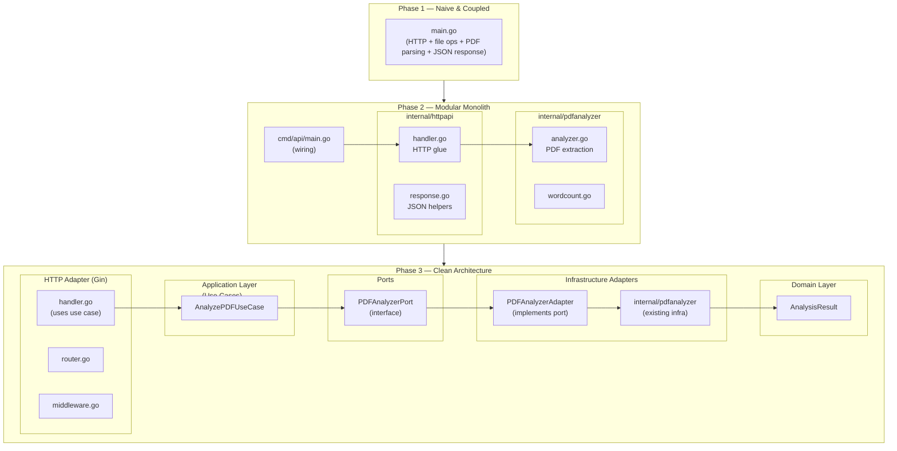

# 📄 PDF Expert — Evolution Towards Clean Architecture

A Go service for analyzing PDF files, progressively evolved from a naive prototype into a modular, testable, and cleanly architected application.

## 📌 Overview

This project is intentionally built in **phases**, simulating the real evolution of a production system.  
Each phase improves structure, separation of concerns, testability, and maintainability.

---

# 🧱 Phase 1 — Minimal, Naive, Fully Coupled

- Single `main.go`
- Handler performed:
  - file upload
  - temp file creation
  - PDF parsing
  - word counting
  - JSON response
- No layers, no structure, no separation.

The goal was **zero architecture**, only to validate the PDF library (`ledongthuc/pdf`).

---

# 🧱 Phase 2 — Modularization and Foundations

Phase 2 introduced structure without over-engineering:

## ✔ 2.1 — Split into internal packages
- `internal/pdfanalyzer`
- `internal/httpapi`
- `cmd/api`
- Basic services extracted from handlers.

## ✔ 2.2 — First tests
- Testdata-based integration testing  
- Unit tests for word counting  
- ADRs documenting the choices

## ✔ 2.3 — HTTP response standardization + middleware
- JSON envelopes (`success`, `error`, `request_id`)
- Basic logging, panic recovery, request ID

## ✔ 2.4 — Router replaced with Gin + slog + central config
- Gin as HTTP framework
- slog for structured logging
- internal/config for centralized environment settings

This phase prepared the project to evolve **cleanly**.

---

## 🧱 Phase 3.2 — DTO Boundary Formalization

In this phase, the architecture introduces **formal DTOs** inside the
`internal/app/dto` package.

DTOs decouple the application layer from:

- HTTP handlers
- JSON shaping
- domain internals
- infrastructure concerns
- file handling

Handlers now transform:

HTTP → DTO → UseCase → DTO → HTTP

This eliminates cross-layer leakage and creates a stable boundary that future
adapters (CLI, gRPC, queue consumers, scheduled jobs) can reuse without
modifying the application or domain layers.

## 🧱 Phase 3.3 — Validation Layer (DTO + Domain Rules)

The system now introduces **formal validation** at two levels:

### 1. DTO Validation
Validates external input before it enters the application layer.
Prevents malformed requests, missing fields, or invalid shapes.

### 2. Domain Validation
Ensures the domain cannot represent invalid states.
Domain objects (`AnalysisResult`) now validate their own invariants.

### 3. Use Case Enforcement
Use cases orchestrate validation, mapping:
DTO → Domain → DTO → HTTP.

This prevents invalid data from leaking into the domain and keeps the system
predictable, testable, and resilient.

## 🧱 Phase 3.4 — Unit Testing Use Cases with Mocked Ports

The project now includes **true unit tests** for the application layer.

Using a mock of `PDFAnalyzerPort`, the use case is tested:

- without the filesystem  
- without the PDF library  
- without Gin  
- without adapters  

This proves the Clean Architecture dependency rule:
application logic depends **only** on ports and domain types.

These tests validate:
- input validation (DTO),
- domain invariants,
- error propagation,
- correct orchestration.

This is the first stage of building a fully testable, production-grade architecture.

---

# 🛣 Next Steps (Phase 3.1)

To fully activate Clean Architecture:

1. **Rewrite handler** to use:
   - AnalyzePDFUseCase
   - not the PDF analyzer directly

2. **Update router** to pass the use case instead of the analyzer.

3. **Rewrite `main.go` wiring**:
   - Create core PDFAnalyzer (infra)
   - Create PDFAnalyzerAdapter
   - Create AnalyzePDFUseCase
   - Pass use case into handlers

After that, the old infra analyzer stops leaking into the HTTP layer.

---

# 🚀 Future Phases

## Phase 4 — Storage, persistence, caching
## Phase 5 — Observability (metrics, tracing)
## Phase 6 — Multiple analyzers (OCR, text models, embeddings)
## Phase 7 — Authentication and multi-tenant support
