# 📄 PDF Expert — Go Clean Architecture PDF Analyzer

A Go service for **analyzing PDF files** (word counting for now), purposely built to show the **real evolution** of a backend:

- from a tightly-coupled script,
- to a **testable, observable, well-structured, clean architecture** service,
- with **Clean Architecture**, **ports/adapters**, **DTOs**, **validation**, **Prometheus metrics**, **Swagger/OpenAPI**, **unit and handler tests**.

This repository is not just “a Go project”;  
it is a case study of **how a system starts ugly and grows the right way**.

---

## 🚀 Features

- PDF upload via `multipart/form-data`
- Text extraction and word counting
- HTTP API built with **Gin**
- Layered architecture:
  - Domain
  - Application (Use Cases)
  - Ports
  - Adapters (Infrastructure)
  - HTTP (Gin)
- **Clean Architecture** enforced (handlers → use cases → ports → adapters → infra)
- **Formal DTOs** for inputs and outputs
- **Validation**:
  - DTO-level (external input)
  - Domain-level (invariants)
- **Structured logging** with `slog`
- Centralized configuration (`internal/config`)
- **Prometheus** metrics at `/metrics`:
  - `http_requests_total`
  - `http_error_total`
  - `http_request_duration_seconds`
- **Swagger/OpenAPI** at `/docs/index.html`
- Tests:
  - Use case tests with **mocked ports**
  - Handler tests using Gin + `httptest`

---

## 🧱 High-Level Architecture

Final architecture flow:

- HTTP Handler (Gin)  
  → Use Case (Application Layer)  
  → Port Interface (`PDFAnalyzerPort`)  
  → Adapter (`PDFAnalyzerAdapter`)  
  → Infra (`internal/pdfanalyzer` + PDF library)  
  → Domain (`AnalysisResult`)

Dependencies always **point inward**, never outward.

---

## 🧭 Evolution by Phases

This project is intentionally built in phases, to demonstrate how a backend naturally evolves.

### Phase 1 — Naive & Coupled

- A single `main.go`
- The handler did everything:
  - receive the upload
  - save a temp file
  - open the PDF and count words
  - return JSON
- No layers, no separation, no tests.

Goal: **quickly validate the PDF library**. Zero architecture on purpose.

---

### Phase 2 — Modular Monolith

We start separating responsibilities without jumping straight into full Clean Architecture.

**2.1 — Split into internal packages**

- `cmd/api/main.go` as the entrypoint
- `internal/pdfanalyzer` for analysis logic
- `internal/api` for HTTP handlers and responses

**2.2 — Initial tests**

- Tests focused on:
  - word counting
  - basic PDF reading

**2.3 — Standardized responses + middleware**

- JSON envelope:
  - success:  
    `{ "success": true, "data": { ... }, "request_id": "..." }`
  - error:  
    `{ "success": false, "error": "message", "request_id": "..."}`
- Basic middleware:
  - request ID
  - logging
  - panic recovery

**2.4 — Gin router + slog + centralized config**

- Switched from raw `net/http` to **Gin**
- Structured logging with `slog`
- Centralized configuration:
  - `APP_ENV`
  - `HTTP_PORT`
  - `TEMP_FOLDER`

This phase prepared the codebase to separate domain and infrastructure properly.

---

### Phase 3 — Clean Architecture

Here the architecture stops being “organized” and becomes truly **clean**.

#### 3.1 — Domain Layer

`internal/domain/analysis.go`:

- Entity `AnalysisResult`
- No framework, HTTP, PDF, or Gin imports
- Pure domain logic

#### 3.2 — Application Layer (Use Cases) + Ports + Adapters

- `internal/app/usecase/analyze_pdf.go`:
  - `AnalyzePDFUseCase`
- `internal/app/port/pdf_analyzer.go`:
  - `PDFAnalyzerPort` (interface)
- `internal/adapter/pdf/pdf_analyzer_adapter.go`:
  - `PDFAnalyzerAdapter` implementing the port using `internal/pdfanalyzer`

Flow:

- Handler calls the **Use Case**
- Use Case depends only on the **Port**
- Adapter connects the Port to the real infra implementation

#### 3.3 — Formal DTOs

`internal/app/dto/analyze_pdf.go`:

- `AnalyzePDFInputDTO`
- `AnalyzePDFOutputDTO`

Handlers now convert:

- HTTP → DTO → Use Case → DTO → HTTP

Use cases do not know about HTTP, JSON, or Gin.

#### 3.4 — Validation (DTO + Domain)

- DTO:
  - `AnalyzePDFInputDTO.Validate()` ensures `FilePath` is valid
- Domain:
  - `AnalysisResult.Validate()` ensures:
    - content is not empty
    - word count is not negative

The use case:

- validates the DTO
- calls the Port
- validates the Domain entity
- returns the DTO

#### 3.5 — Use Case Unit Tests (Mocked Port)

- `internal/app/port/mock/pdf_analyzer_mock.go`:
  - mock implementation of `PDFAnalyzerPort`
- `internal/app/usecase/analyze_pdf_test.go`:
  - tests:
    - happy path
    - invalid DTO
    - port error
    - domain validation error

These tests do **not** touch:

- disk
- real PDFs
- Gin
- HTTP

This proves Clean Architecture is **actively enforced**, not just drawn in a diagram.

#### 3.6 — Handler Tests (Gin Test Framework)

- `internal/api/handler_test.go`:
  - uses `httptest.NewRecorder` and `gin.New()`
  - simulates file upload
  - asserts:
    - HTTP status codes
    - JSON response structure
    - behavior under failure conditions

#### 3.7 — Observability with Prometheus

- Metrics middleware:
  - `http_requests_total`
  - `http_error_total`
  - `http_request_duration_seconds`
- Exposed endpoint:
  - `GET /metrics` (for Prometheus scraping)

#### 3.8 — OpenAPI Documentation (Swagger)

- Swagger annotations in handlers
- Generation via:
  - `swag init -g cmd/api/main.go -o cmd/api/docs`
- Swagger UI:
  - `GET /docs/index.html`

---

## 📊 Architecture Evolution Diagram (Mermaid)

Below is a Mermaid diagram describing the **evolution from Phase 1 to Phase 3**.  

```mermaid
flowchart TD

%% ============================
%% PHASE 1 — NAIVE MONOLITH
%% ============================

subgraph P1["Phase 1 — Naive & Coupled"]
    M1["main.go
    (HTTP + file ops + PDF parsing + JSON response)"]
end

%% ============================
%% PHASE 2 — MODULAR MONOLITH
%% ============================

subgraph P2["Phase 2 — Modular Monolith"]

    subgraph H2["internal/api"]
        H2A["handler.go
        HTTP glue"]
        H2B["response.go
        JSON helpers"]
    end

    subgraph PA2["internal/pdfanalyzer"]
        PA2A["analyzer.go
        PDF extraction"]
        PA2B["wordcount.go"]
    end

    CMD2["cmd/api/main.go
    (wiring)"]

    CMD2 --> H2A --> PA2A
end

%% ============================
%% PHASE 3 — CLEAN ARCHITECTURE
%% ============================

subgraph P3["Phase 3 — Clean Architecture"]

    %% Domain
    subgraph D3["Domain Layer"]
        D3A["AnalysisResult"]
    end

    %% App Layer
    subgraph A3["Application Layer
    (Use Cases)"]
        A3A["AnalyzePDFUseCase"]
    end

    %% Ports
    subgraph Port3["Ports"]
        P3A["PDFAnalyzerPort
        (interface)"]
    end

    %% Adapter Layer (Infra)
    subgraph AD3["Infrastructure Adapters"]
        AD3A["PDFAnalyzerAdapter
        (implements port)"]
        AD3B["internal/pdfanalyzer
        (existing infra)"]
    end

    %% HTTP Layer (Framework)
    subgraph HTTP3["HTTP Adapter (Gin)"]
        H3A["handler.go
        (uses use case)"]
        H3B["router.go"]
        H3C["middleware.go
        + metrics + swagger"]
    end

    %% Flow inside Phase 3
    H3A --> A3A
    A3A --> P3A
    P3A --> AD3A
    AD3A --> AD3B
    AD3B --> D3A
end

%% ============================
%% TRANSITIONS BETWEEN PHASES
%% ============================

P1 --> P2 --> P3
```



---

## 🗂 Simplified Folder Structure

```text
pdf-expert/
  cmd/
    api/
      main.go
      docs/                  # swagger generated by swag
  internal/
    app/
      dto/
        analyze_pdf.go
      port/
        pdf_analyzer.go
        mock/
          pdf_analyzer_mock.go
      usecase/
        analyze_pdf.go
        analyze_pdf_test.go
    adapter/
      pdf/
        pdf_analyzer_adapter.go
    domain/
      analysis.go
      errors.go
    api/
      handler.go
      handler_test.go
      router.go
      middleware.go
      metrics.go
      response.go
    pdfanalyzer/
      analyzer.go            # real implementation using ledongthuc/pdf
    config/
      config.go
    log/
      logger.go
  ADR/
    ADR-001.md ... ADR-021.md
  go.mod
  go.sum
```

---

## 🔧 Requirements

- Go 1.20+ (or as defined in `go.mod`)
- Swag for OpenAPI generation

```shell
go install github.com/swaggo/swag/cmd/swag@latest
```

- Dependencies managed via Go Modules

```shell
go mod tidy
```

---

## ▶️ How to Run the API

From the project root:

```shell
go run cmd/api/main.go
```

By default:

- API: `http://localhost:8080`
- Swagger: `http://localhost:8080/docs/index.html`
- Prometheus metrics: `http://localhost:8080/metrics`

---

## 📡 Main Endpoint

### `POST /analyze`

- Content-Type: `multipart/form-data`
- Field: `file` (PDF file)

Example using `curl`:

```shell
curl -X POST http://localhost:8080/analyze \
  -F "file=@/path/to/file.pdf"
```

Example success response:

```json
{
  "success": true,
  "data": {
    "file": "file.pdf",
    "word_count": 1234,
    "status": "completed"
  },
  "request_id": "e6b3e5d1-2d7f-4bda-a1b5-..."
}
```

Example error response:

```json
{
  "success": false,
  "error": "explanation of the problem",
  "request_id": "..."
}
```

Status codes:

- `200` — success
- `400` — invalid input / missing file
- `422` — domain-level error (e.g., unusable PDF content)
- `500` — internal error

---

## 📊 Observability (Prometheus)

Metrics endpoint:

- `GET /metrics`

Examples of metrics:

- `http_requests_total{method="POST", path="/analyze"}`
- `http_error_total{method="POST", path="/analyze", status="Internal Server Error"}`
- `http_request_duration_seconds_bucket{...}`

Typical integration:

- Prometheus scraping `/metrics`
- Grafana dashboards built on top of this data

---

## 📚 API Documentation (Swagger / OpenAPI)

Swagger UI:

- `GET /docs/index.html`

Regenerate docs after changing handlers, comments, or DTOs:

```shell
swag init -g cmd/api/main.go -o cmd/api/docs
```

Swagger annotations live only in the HTTP adapter.  
Domain, use cases, and ports remain framework-agnostic.

---

## 🧪 Tests

### Use Case Tests (Application Layer)

Run:

```shell
go test ./internal/app/usecase -v
```

Covers:

- invalid DTO
- port error
- domain validation error
- happy path

### Handler Tests (HTTP Layer)

Run:

```shell
go test ./internal/api -v
```

Covers:

- valid upload returning 200
- missing file returning 400

### Full test suite

```shell
go test ./... -v
```

---

## 🧱 Architectural Decisions (ADRs)

Each major architectural decision is documented under `ADR/`.

Examples:

- `ADR-010` — adopt Gin as HTTP router
- `ADR-011` — centralized config in `internal/config`
- `ADR-012` — structured logging with `slog`
- `ADR-013` — introduction of Domain Layer
- `ADR-014` — Application Layer and Use Cases
- `ADR-015` — Ports and Adapters
- `ADR-016` — Formal DTOs
- `ADR-017` — DTO + Domain validation
- `ADR-018` — Use Case tests with mocked ports
- `ADR-019` — Handler tests using Gin Test Framework
- `ADR-020` — Prometheus observability
- `ADR-021` — Swagger/OpenAPI in HTTP adapter

This makes it possible to understand **why** the architecture looks like this, not just *how*.

---

## 🛣 Possible Next Steps

- New use case: advanced metadata extraction
- Dockerfile + Docker Compose for easy local setup
- Persistence of analysis results (SQLite/Redis) via ports/adapters (Cache Aside)
- API versioning (v1, v2)
- Authentication (JWT) as an additional adapter

---

## 🎯 Educational Purpose

This project is intended to:

- show the difference between:
  - code that “just works”
  - and a system that can **grow safely**
- serve as a reference for technical interviews:
  - explaining incremental evolution
  - justifying decisions with ADRs
  - demonstrating solid understanding of architecture, testing, and observability
- act as a realistic template for Go services following Clean Architecture.
