# 📄 PDF Expert — Evolution Towards Clean Architecture

A Go service for analyzing PDF files, progressively evolved from a naive prototype into a modular, testable, and cleanly architected application.

## 📌 Overview

This project is intentionally built in **phases**, simulating the real evolution of a production system.  
Each phase improves structure, separation of concerns, testability, and maintainability.

---

```mermaid
flowchart TD

%% ============================
%% PHASE 1 — NAIVE MONOLITH
%% ============================

subgraph P1["Phase 1 — Naive & Coupled"]
    M1["main.go\n(HTTP + file ops + PDF parsing + JSON response)"]
end

%% ============================
%% PHASE 2 — MODULARIZATION
%% ============================

subgraph P2["Phase 2 — Modular Monolith"]
    
    subgraph H2["internal/httpapi"]
        H2A["handler.go\nHTTP glue"]
        H2B["response.go\nJSON helpers"]
    end

    subgraph PA2["internal/pdfanalyzer"]
        PA2A["analyzer.go\nPDF extraction"]
        PA2B["wordcount.go"]
    end

    CMD2["cmd/api/main.go\n(wiring)"]

    CMD2 --> H2A --> PA2A
end

%% ============================
%% PHASE 3 — CLEAN ARCHITECTURE
%% ============================

subgraph P3["Phase 3 — Clean Architecture"]

    %% Domain
    subgraph D3["Domain Layer"]
        D3A["AnalysisResult"]
    end

    %% App Layer
    subgraph A3["Application Layer\n(Use Cases)"]
        A3A["AnalyzePDFUseCase"]
    end

    %% Ports
    subgraph Port3["Ports"]
        P3A["PDFAnalyzerPort\n(interface)"]
    end

    %% Adapter Layer (Infra)
    subgraph AD3["Infrastructure Adapters"]
        AD3A["PDFAnalyzerAdapter\n(implements port)"]
        AD3B["internal/pdfanalyzer\n(existing infra)"]
    end

    %% HTTP Layer (Framework)
    subgraph HTTP3["HTTP Adapter (Gin)"]
        H3A["handler.go\n(uses use case)"]
        H3B["router.go"]
        H3C["middleware.go"]
    end

    %% Flow inside Phase 3
    H3A --> A3A
    A3A --> P3A
    P3A --> AD3A
    AD3A --> AD3B
    AD3B --> D3A
end

%% ============================
%% TRANSITIONS BETWEEN PHASES
%% ============================

P1 --> P2 --> P3
```

# 🧱 Phase 1 — Minimal, Naive, Fully Coupled

- Single `main.go`
- Handler performed:
  - file upload
  - temp file creation
  - PDF parsing
  - word counting
  - JSON response
- No layers, no structure, no separation.

The goal was **zero architecture**, only to validate the PDF library (`ledongthuc/pdf`).

---

# 🧱 Phase 2 — Modularization and Foundations

Phase 2 introduced structure without over-engineering:

## ✔ 2.1 — Split into internal packages
- `internal/pdfanalyzer`
- `internal/httpapi`
- `cmd/api`
- Basic services extracted from handlers.

## ✔ 2.2 — First tests
- Testdata-based integration testing  
- Unit tests for word counting  
- ADRs documenting the choices

## ✔ 2.3 — HTTP response standardization + middleware
- JSON envelopes (`success`, `error`, `request_id`)
- Basic logging, panic recovery, request ID

## ✔ 2.4 — Router replaced with Gin + slog + central config
- Gin as HTTP framework
- slog for structured logging
- internal/config for centralized environment settings

This phase prepared the project to evolve **cleanly**.

---

# 🧱 Phase 3 — Clean Architecture (Current Phase)

Phase 3 introduces the core pillars:

## ✔ Domain Layer (Entities)
`internal/domain/analysis.go`
- Contains domain concepts  
- Pure Go types  
- No infrastructure or framework dependencies  

## ✔ Application Layer (Use Cases)
`internal/app/usecase/analyze_pdf.go`
- Orchestrates the PDF analysis flow  
- Consumes ports  
- Returns domain types  
- Independent of HTTP, files, or libraries  

## ✔ Ports (Interfaces)
`internal/app/port/pdf_analyzer.go`
- Boundary between application and infrastructure  
- The application layer depends only on ports  

## ✔ Adapters (Implementations)
`internal/adapter/pdf/pdf_analyzer_adapter.go`
- Adapts the existing infrared component (`internal/pdfanalyzer`)  
- Translates between infra types and domain types  

This completes the foundation for true Clean Architecture:

HTTP Handler → Use Case → Port → Adapter → Infra Library

---

# 🛣 Next Steps (Phase 3.1)

To fully activate Clean Architecture:

1. **Rewrite handler** to use:
   - AnalyzePDFUseCase
   - not the PDF analyzer directly

2. **Update router** to pass the use case instead of the analyzer.

3. **Rewrite `main.go` wiring**:
   - Create core PDFAnalyzer (infra)
   - Create PDFAnalyzerAdapter
   - Create AnalyzePDFUseCase
   - Pass use case into handlers

After that, the old infra analyzer stops leaking into the HTTP layer.

---

# 🚀 Future Phases

## Phase 4 — Storage, persistence, caching
## Phase 5 — Observability (metrics, tracing)
## Phase 6 — Multiple analyzers (OCR, text models, embeddings)
## Phase 7 — Authentication and multi-tenant support
